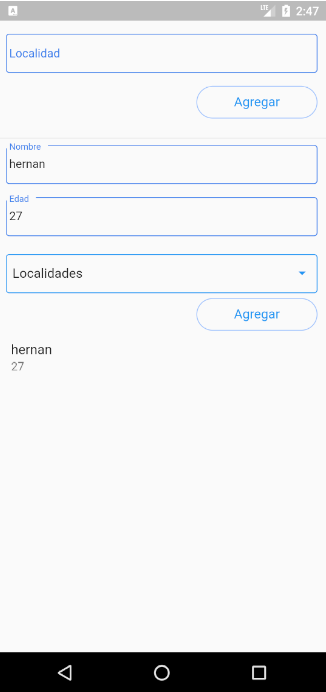

# flutter_modelo_mvc

Ejemplo modelo MVC con flutter_bloc. Es un ejemplo de una estructura de directorios y manejo de datos testeables. Actualmente no se esta utilizando esto

## Diseño de ventanas

